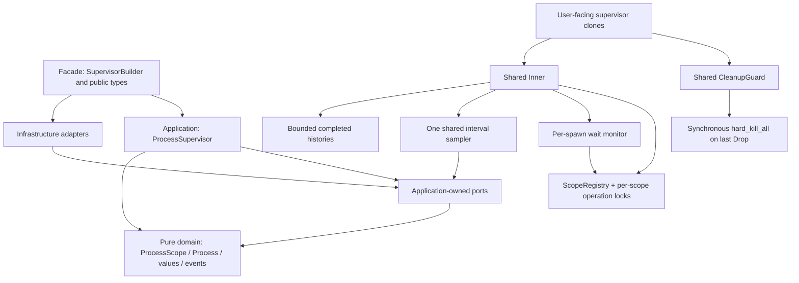
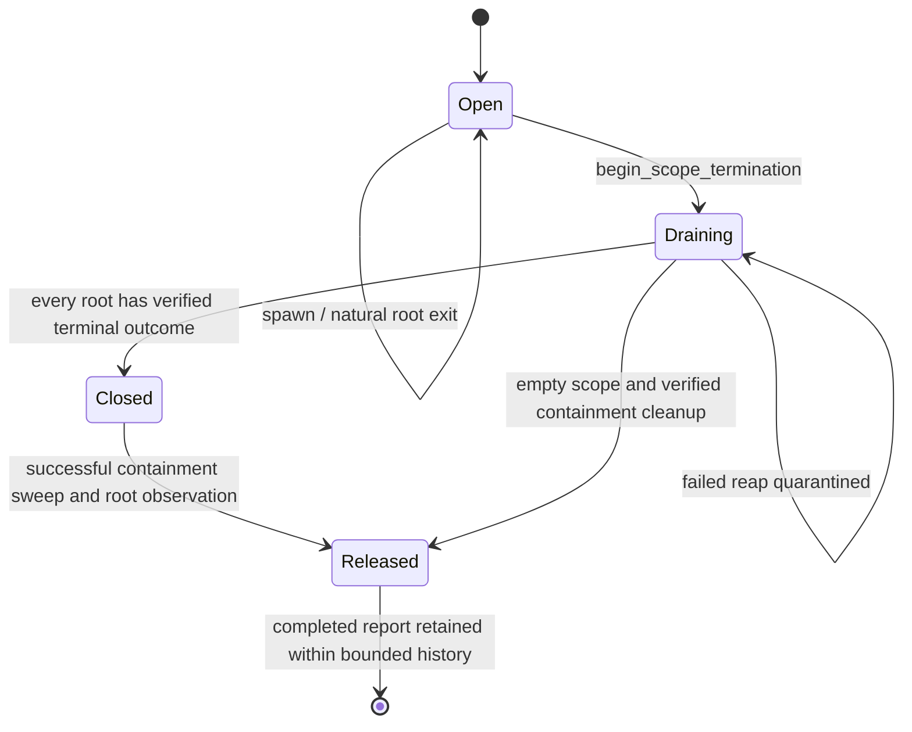
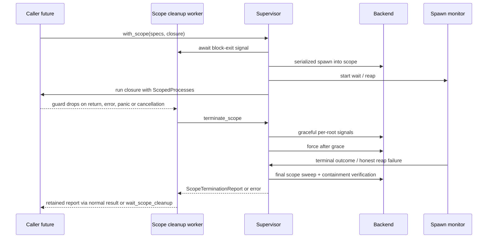
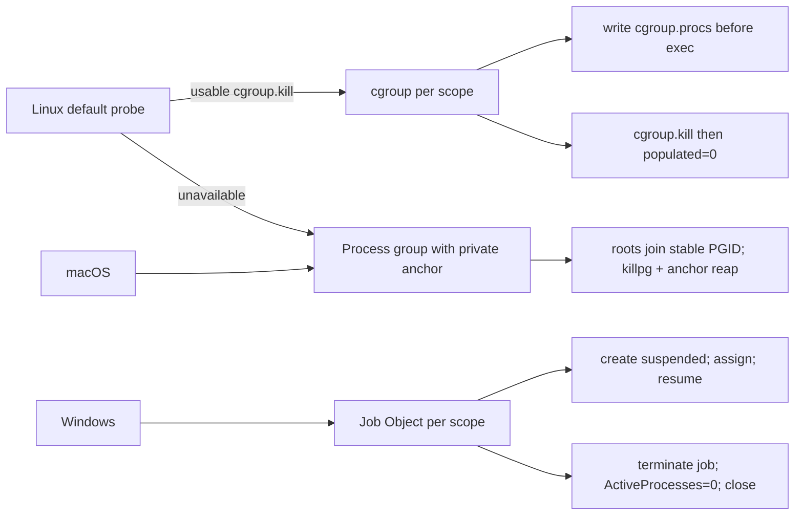
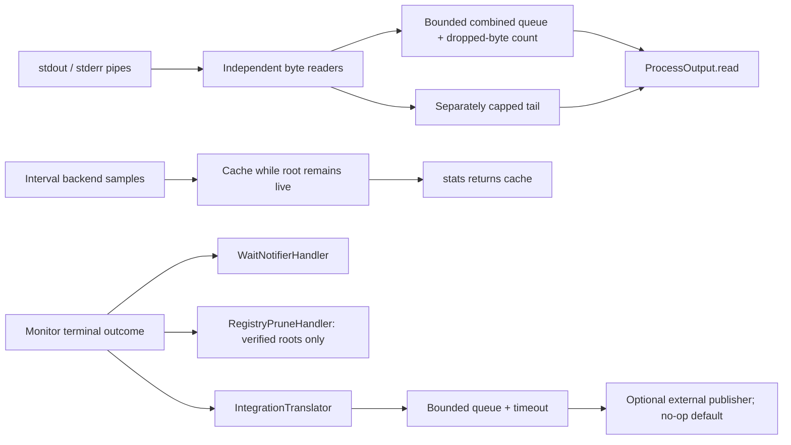

# Shepherd — implementation diagrams

## Dependencies and runtime ownership

Workers retain Inner, never CleanupGuard. The sampler keeps a Weak reference between
intervals. Registry locks never span an await; scope-operation locks deliberately span
spawn and cleanup. The domain has no runtime, OS, filesystem, network or unsafe code.

## Scope lifecycle and verification

Root exit alone does not release containment: descendants can outlive their roots.
Process-group scopes retain a private anchor until explicit scope cleanup. Cgroup and
Job Object scopes retain their kernel resource until emptiness is verified.

## Block exit and cancellation

Dropping terminate() stops driving that invocation; it does not trigger an ownership
kill. Runtime shutdown of the scope worker invokes a scope-only synchronous backstop
and records an unverified error. A stopped runtime cannot prove asynchronous reap.

## Backend mechanisms

Cgroups and Jobs contain detached descendants; groups do not. Cgroups do not have an
automatic creator-death kill. Job close protection starts at assignment.

## Observations and events

Capture never blocks on caller consumption. Discard uses the OS null device. Sample
and output errors do not relinquish process ownership. Inspect TerminationOutcome
before treating a terminal event as proof of reap.
