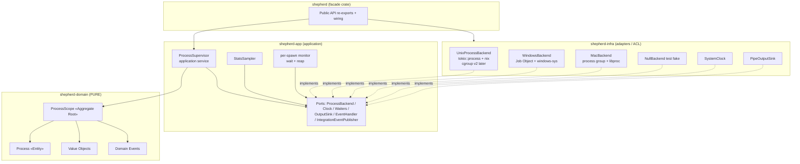
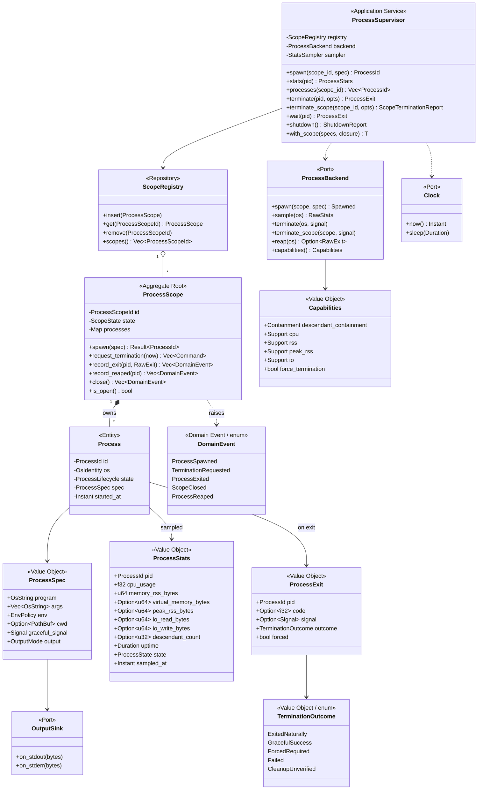
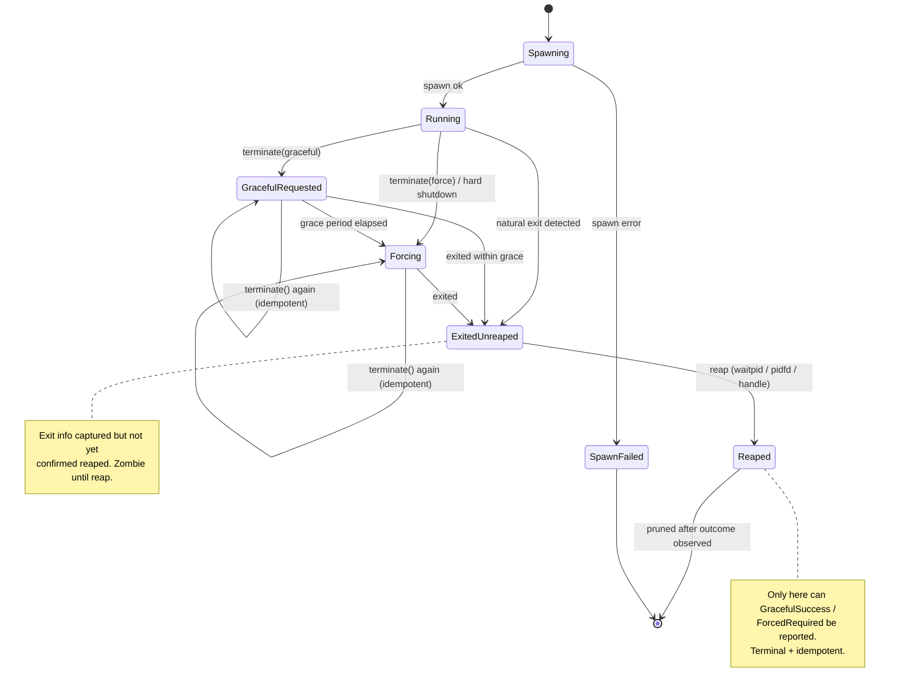
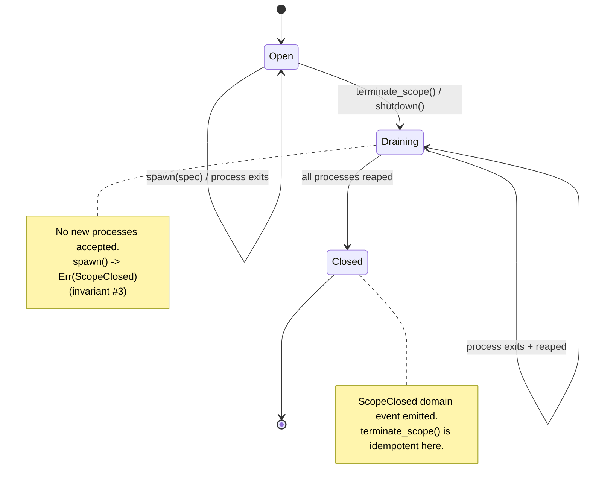
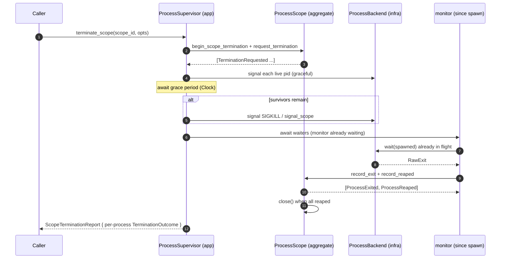
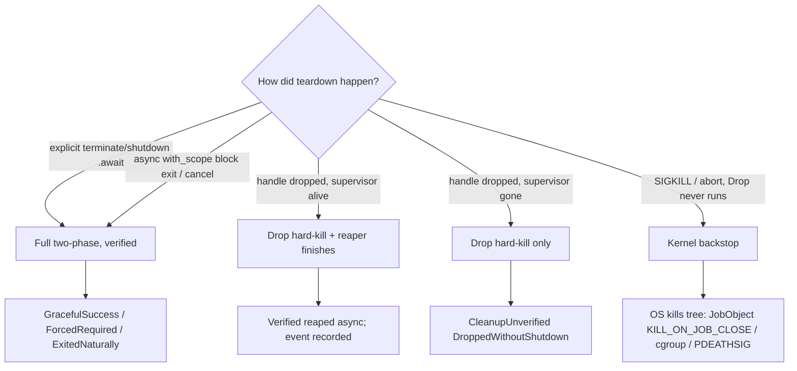
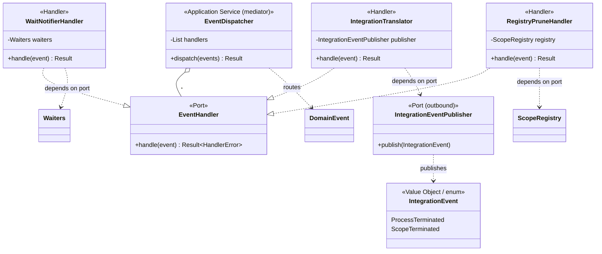

# Shepherd — Class & State Diagrams

Companion to [`DESIGN.md`](./DESIGN.md). Diagrams use [Mermaid](https://mermaid.js.org/)
and render on GitHub. DDD stereotypes are shown with `<<...>>` annotations.

---

## 1. Layer / dependency diagram (hexagonal)

Dependencies point **inward only**: `infra → app → domain`. Enforced by the
`ddd-architecture` CI job.



> The domain never depends on `app`, `infra`, or any OS crate (and has no async). The driven
> **ports live in `shepherd-app`**; adapters in `shepherd-infra` *implement* them; wiring
> happens only in the facade.

---

## 2. Class diagram — domain model



Notes:
- `ProcessScope` is the **consistency boundary**; `Process` is only reachable *through* it
  (composition `*--`). External code holds `ProcessId`, never a `Process`/`Child`.
- `ProcessBackend`, `Clock`, `OutputSink` are **application-owned driven ports** (in
  `shepherd-app`, not the domain); the concrete backends (`LinuxBackend`, …) implement them in
  `shepherd-infra`.

---

## 3. State diagram — process lifecycle



Illegal transitions are unrepresentable in the type/state machine. Terminal states
(`Reaped`, `SpawnFailed`) make repeated `terminate`/`wait`/`shutdown` calls no-ops that
return the recorded outcome.

---

## 4. State diagram — scope lifecycle (aggregate)



---

## 5. Sequence diagram — `terminate_scope` (verified two-phase)



Success in the report means **verified**: processes confirmed gone *and* reaped — never
merely "signal sent". A path that cannot confirm returns
`CleanupUnverified(<reason>)` rather than a false success.

---

## 6. State diagram — cleanup tiers (where an outcome comes from)



---

## 7. Class diagram — event handling (domain vs integration)

In-process **domain events** drive same-context handlers that depend only on ports;
**integration events** cross Shepherd's boundary through an outbound, decoupled publisher.



Notes:
- All handlers depend on **ports**, never concretions (dependency inversion), so each is
  isolated and testable with fakes; wiring/injection happens only in the facade.
- `IntegrationTranslator` maps the externally-meaningful *subset* of domain events to
  integration events. A slow/absent `IntegrationEventPublisher` cannot affect Shepherd's
  internal invariants.

---

## 8. Sequence diagram — event dispatch (in-process domain events → optional integration)

```mermaid
sequenceDiagram
    autonumber
    participant APP as ProcessSupervisor (app)
    participant AGG as ProcessScope (aggregate)
    participant D as EventDispatcher (mediator)
    participant H2 as WaitNotifierHandler
    participant H3 as RegistryPruneHandler
    participant IT as IntegrationTranslator
    participant PUB as IntegrationEventPublisher

    Note over APP: monitor task already waiting since spawn (ADR 0008)
    APP->>APP: backend.wait(spawned)
    APP->>AGG: record_exit + record_reaped
    AGG-->>APP: [ProcessExited, ProcessReaped]
    Note over APP: transition committed under lock, then lock released
    APP->>D: dispatch([ProcessExited, ProcessReaped])
    D->>H2: handle(ProcessReaped) -> wake wait(pid)
    D->>H3: handle(ProcessReaped) -> prune + release resource
    D->>IT: handle(ProcessReaped)
    IT->>PUB: publish(ProcessTerminated)
    Note over IT,PUB: bounded, lossy-tolerant; cannot stall Shepherd
    Note over D: handler error -> typed HandlerError + tracing, never swallowed
```
